

<picture><source media="(prefers-color-scheme: dark)" srcset="assets/dark/header.svg"></picture>

<a href="https://www.linkedin.com/in/aniketpatil08/"><picture><source media="(prefers-color-scheme: dark)" srcset="assets/dark/pill-linkedin.svg"></picture></a><a href="https://aniket08.vercel.app/"><picture><source media="(prefers-color-scheme: dark)" srcset="assets/dark/pill-portfolio.svg"></picture></a><a href="https://x.com/AniketPatil08"><picture><source media="(prefers-color-scheme: dark)" srcset="assets/dark/pill-x.svg"></picture></a><a href="https://www.instagram.com/aniiiket08"><picture><source media="(prefers-color-scheme: dark)" srcset="assets/dark/pill-instagram.svg"></picture></a><a href="https://discord.gg/tc33P2Cg"><picture><source media="(prefers-color-scheme: dark)" srcset="assets/dark/pill-discord.svg"></picture></a>

 

<picture><source media="(prefers-color-scheme: dark)" srcset="assets/dark/sec-about.svg"></picture>

<picture><source media="(prefers-color-scheme: dark)" srcset="assets/dark/about.svg">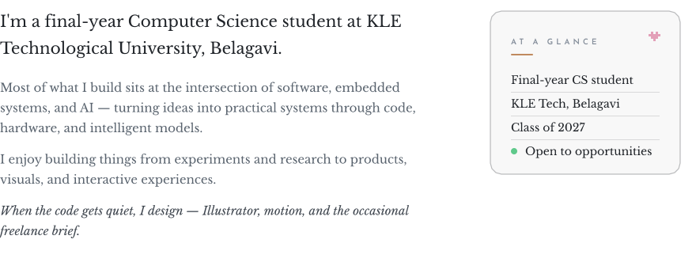</picture>

 

<picture><source media="(prefers-color-scheme: dark)" srcset="assets/dark/sec-built.svg"></picture>

<a href="https://github.com/aniiiket08/indoor-floor-prediction-wifi-sdr"><picture><source media="(prefers-color-scheme: dark)" srcset="assets/dark/row-01.svg">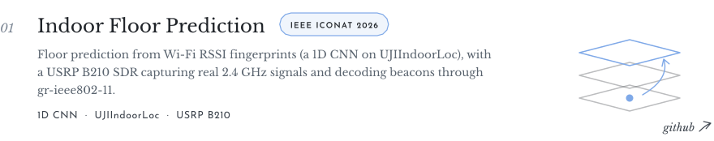</picture></a>

<a href="https://github.com/aniiiket08/automated-prostate-cancer-detection"><picture><source media="(prefers-color-scheme: dark)" srcset="assets/dark/row-02.svg">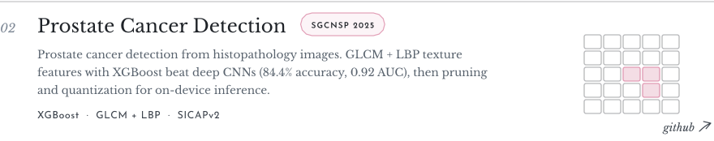</picture></a>

<a href="https://github.com/aniiiket08/smart-wearable-attendance-esp32"><picture><source media="(prefers-color-scheme: dark)" srcset="assets/dark/row-03.svg">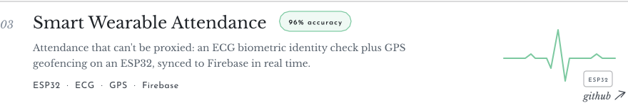</picture></a>

<a href="https://github.com/aniiiket08/neurosleep-digital-twin"><picture><source media="(prefers-color-scheme: dark)" srcset="assets/dark/row-04.svg">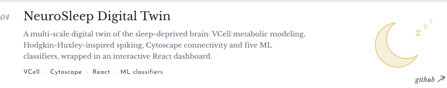</picture></a>

<a href="https://github.com/aniiiket08/adhd-diagnostic-modeling-fmri"><picture><source media="(prefers-color-scheme: dark)" srcset="assets/dark/row-05.svg">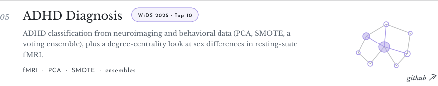</picture></a>

<picture><source media="(prefers-color-scheme: dark)" srcset="assets/dark/row-06.svg"></picture>

 

<picture><source media="(prefers-color-scheme: dark)" srcset="assets/dark/sec-skills.svg"></picture>

<picture><source media="(prefers-color-scheme: dark)" srcset="assets/dark/skills.svg">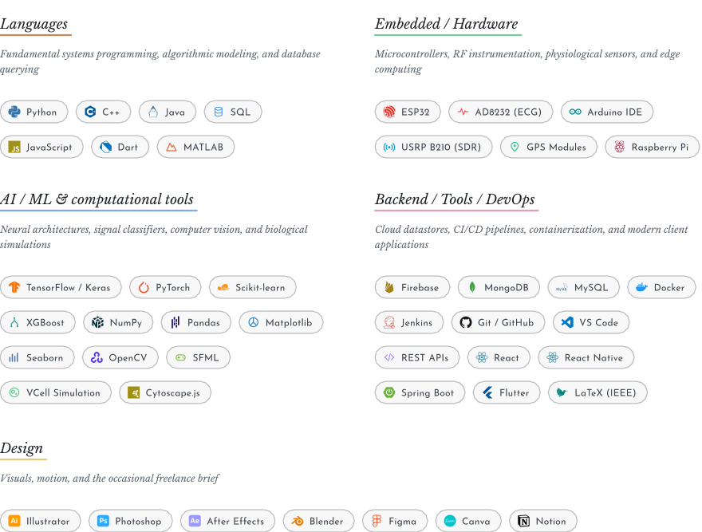</picture>

 

<picture><source media="(prefers-color-scheme: dark)" srcset="assets/dark/sec-wins.svg"></picture>

<picture><source media="(prefers-color-scheme: dark)" srcset="assets/dark/wins.svg">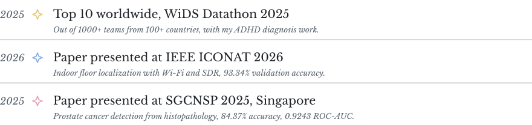</picture>

 

<picture><source media="(prefers-color-scheme: dark)" srcset="assets/dark/sec-hi.svg"></picture>

<picture><source media="(prefers-color-scheme: dark)" srcset="assets/dark/hi.svg"></picture>

<a href="https://www.linkedin.com/in/aniketpatil08/"><picture><source media="(prefers-color-scheme: dark)" srcset="assets/dark/link-linkedin.svg"></picture></a><a href="https://aniket08.vercel.app/"><picture><source media="(prefers-color-scheme: dark)" srcset="assets/dark/link-portfolio.svg"></picture></a><a href="https://x.com/AniketPatil08"><picture><source media="(prefers-color-scheme: dark)" srcset="assets/dark/link-x.svg">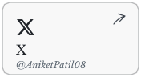</picture></a><a href="https://www.instagram.com/aniiiket08"><picture><source media="(prefers-color-scheme: dark)" srcset="assets/dark/link-instagram.svg">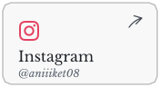</picture></a><a href="https://discord.gg/tc33P2Cg"><picture><source media="(prefers-color-scheme: dark)" srcset="assets/dark/link-discord.svg"></picture></a>

 

<picture><source media="(prefers-color-scheme: dark)" srcset="assets/dark/footer.svg"></picture>

