


  

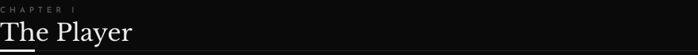

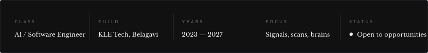

  

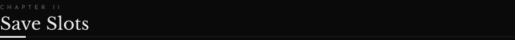

<a href="https://github.com/aniiiket08/indoor-floor-prediction-wifi-sdr"></a>
<a href="https://github.com/aniiiket08/automated-prostate-cancer-detection"></a>
<a href="https://github.com/aniiiket08/smart-wearable-attendance-esp32"></a>
<a href="https://github.com/aniiiket08/neurosleep-digital-twin"></a>
<a href="https://github.com/aniiiket08/adhd-diagnostic-modeling-fmri"></a>
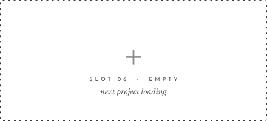

 

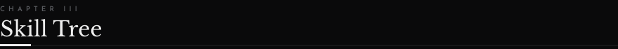


  

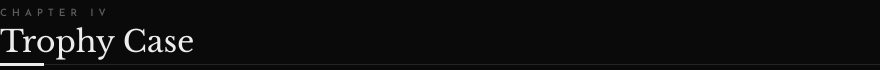


  

<a href="https://www.linkedin.com/in/aniketpatil08/">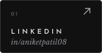</a>
<a href="https://aniket08.vercel.app/">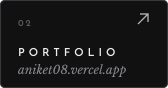</a>
<a href="https://x.com/AniketPatil08">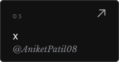</a>
<a href="https://www.instagram.com/aniiiket08">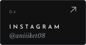</a>
<a href="https://discord.gg/tc33P2Cg">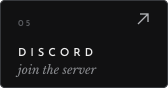</a>

  

